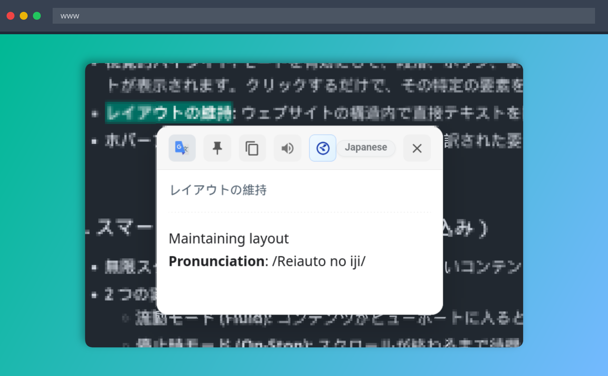
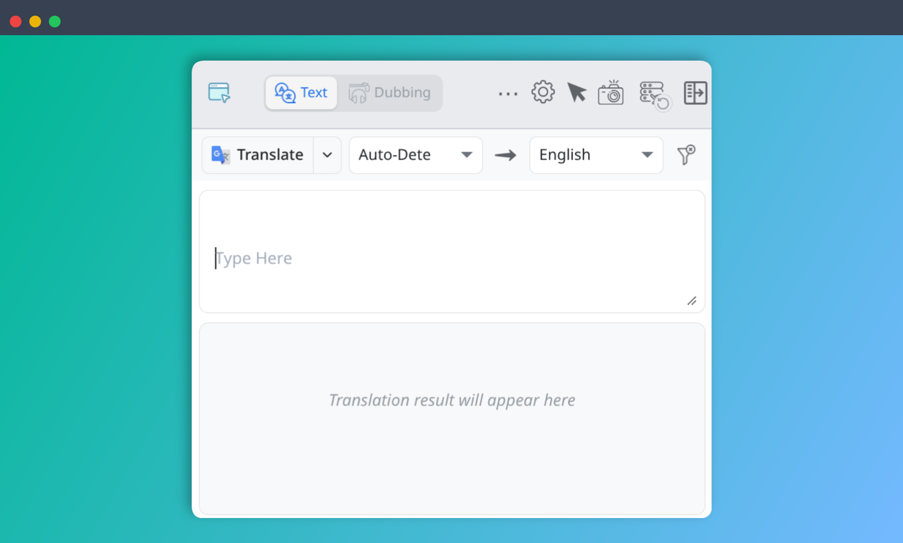
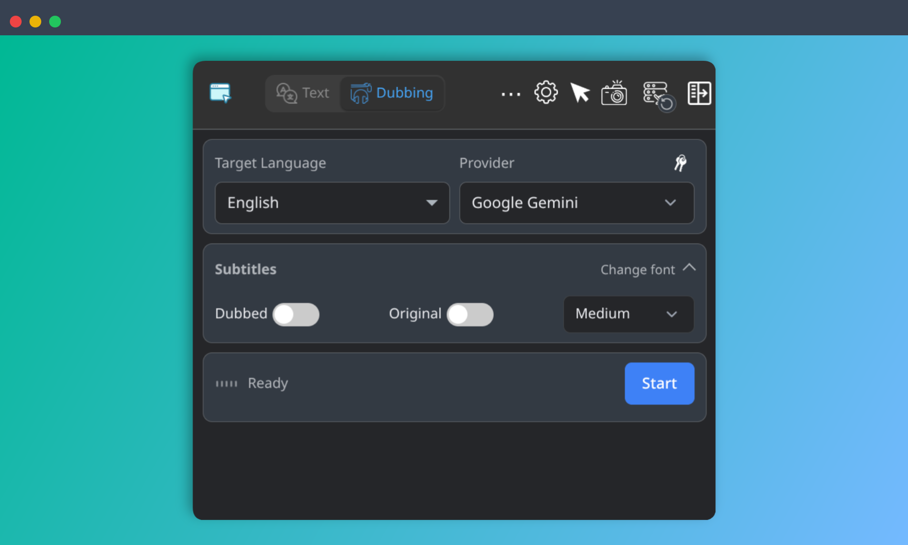
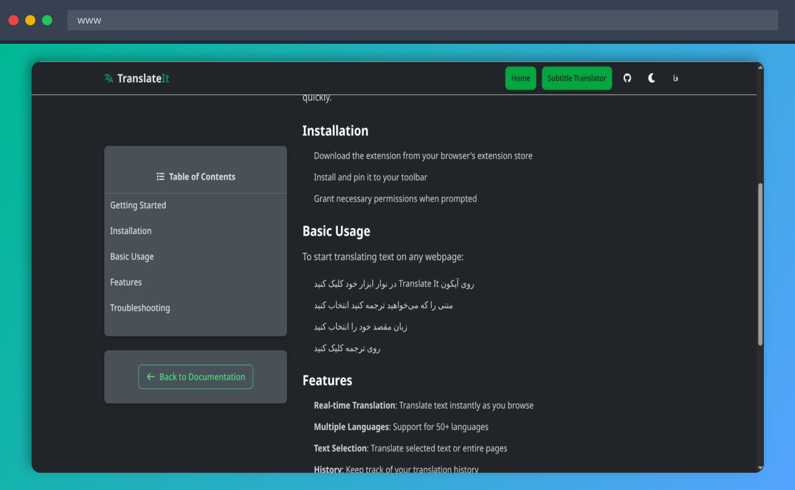
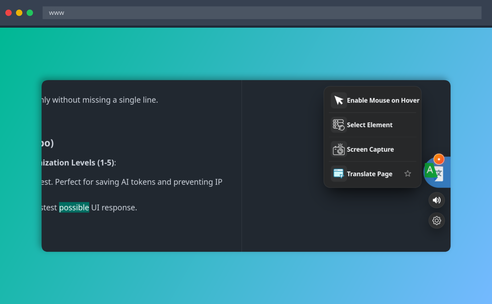

# Translate It!
> Translate the web, your way.

  
  

 

---

 

  <strong>
    • English | 
    • <a href="./docs/README_FARSI.md">فارسی</a> | 
    • <a href="./docs/README_JAPANESE.md">日本語</a>
  </strong>

 

**Translate It** is more than a translator; it's a modular translation ecosystem built around a "zero-pressure" philosophy. Designed to stay lightweight during everyday browsing, it brings text, page, document, image, subtitle, and live-audio translation into one extension across desktop, touch, and mobile environments.

Powered by **10+ translation providers**, Translate It focuses on privacy, flexibility, performance, and giving users control over how and where their translations are processed.

 

  <a href="https://youtu.be/VxgRWlx20wU">
    <b>Watch Demo on YouTube</b>
  </a>
   
  

---

## Goals

- **Privacy and control:** Choose how your translations are processed, including local, offline, free, and cloud-based providers where supported.
- **Freedom to choose:** Switch between traditional and AI-powered translation providers without being locked into a single service.
- **One tool for different needs:** Translate selected text, input fields, page elements, full pages, PDFs, subtitles, images with OCR, text on hover, and live audio.
- **Built for everyday browsing:** Designed for dynamic pages, long content, continuous translation, desktop, touch, and mobile environments.

---

## Features at a Glance

| Feature | Description |
| :--- | :--- |
| **Text Selection** | Translate selected text instantly without leaving the page. |
| **Select Element** | Translate specific page elements inline while preserving the surrounding layout. |
| **Whole Page** | Translate full pages continuously, including dynamically loaded content. |
| **Popup & Side Panel** | Translate text directly from the extension popup or persistent side panel. |
| **Live Dubbing** | Translate active-tab audio in real time using Gemini or OpenAI. **Chrome only.** |
| **PDF Translator** | Translate local and online PDFs with bilingual views, OCR, and export support. |
| **Subtitle (SRT) Translator** | Translate `.srt` subtitle files while preserving timestamps and formatting. |
| **Screen Capture & OCR** | Capture and translate text from images, videos, PDFs, or other non-selectable content. |
| **Mouse Hover** | Translate words, sentences, or text containers directly on hover. |
| **Desktop & Mobile FAB** | Quick access to translation tools through a draggable floating action button. |
| **In-Field (Ctrl+/)** | Translate text directly inside editable fields before sending it. |
| **Dictionary & TTS** | Look up words and listen to source or translated text. |
| **History & Export** | Keep translation history and export it for later use. |

---

## Supported Providers

Choose from traditional, AI-powered, local, and specialized translation providers:

- **Traditional:** [Google Translate](https://translate.google.com/), [Microsoft Edge Translator](https://www.microsoft.com/translator/), [DeepL](https://www.deepl.com/translator), [Yandex](https://translate.yandex.com/), [Lingva](https://github.com/TheDavidDelta/lingva-translate), [Bing](https://www.bing.com/translator)
- **AI:** [Gemini](https://ai.google.dev/), [OpenAI](https://openai.com/api/), [OpenRouter](https://openrouter.ai/), [Requesty](https://www.requesty.ai/), [DeepSeek](https://platform.deepseek.com/)
- **Custom & Local:** OpenAI-Compatible APIs, [WebAI-to-API](https://github.com/Amm1rr/WebAI-to-API/), Browser Translation
- **Dictionary:** [Vajehyab](https://vajehyab.com/)

Some providers require an API key, while others work without one.

**Live Dubbing** currently supports Gemini and OpenAI on Chrome.

---

## Screenshots

<table>
  <tr>
    <td align="center">
      
       
      <b>Text Translation</b>
    </td>
    <td align="center">
      
       
      <b>Live Dubbing</b>
    </td>
  </tr>
  <tr>
    <td align="center">
      
       
      <b>Select Element</b>
    </td>
    <td align="center">
      
       
      <b>Desktop FAB</b>
    </td>
  </tr>
</table>

---

## Getting Started

### 1. Installation
Install via the official stores for the best experience:

  
  

*For manual installation, see the [Installation Guide](./docs/guides/INSTALLATION.md).*

### 2. Configuration
Most AI providers require an API key.
- Follow the [**API Configuration Guide**](./docs/guides/API_GUIDE.md) to set up Gemini, OpenAI, etc.
- *Free providers like Google and Yandex work out of the box.*

### 3. Mastering Shortcuts
Maximize your productivity with the [**User Guide**](./docs/guides/USAGE.md).

---

## Key Features

### 1. Progressive Translation
Large translations are split into smaller units and displayed progressively as results become available.

### 2. Select Element
Translate specific parts of a webpage inline while preserving the surrounding layout, with support for restoring the original content.

### 3. Whole-Page Translation
Continuously translate pages as content appears, with Fluid and Translate-on-Scroll-Stop modes for different browsing and performance needs.

### 4. Live Dubbing
Translate active-tab audio in real time using Gemini or OpenAI, with independent controls for original and dubbed audio. **Chrome only.**

### 5. PDF Translator
Translate local or online PDFs with bilingual views, text selection, OCR for scanned documents, and TXT, Markdown, or HTML export.

### 6. Screen Capture & OCR
Capture any area of a webpage and translate text from images, videos, PDFs, or other non-selectable content using local OCR.

### 7. Subtitle (SRT) Translator
Translate subtitle files while preserving timestamps and formatting, with progress tracking during translation.

### 8. Desktop, Touch & Mobile Experience
Use draggable FAB controls and touch-optimized interfaces across desktop, touchscreen devices, and supported mobile browsers.

### 9. Mouse Hover Translation
Translate a word, sentence, or container directly while browsing, without opening a separate translation interface.

---

## Developer & Contributing

We follow a **Feature-Based Architecture** using Vue 3, Pinia, and Vite.
- **Architecture:** Explore [ARCHITECTURE.md](./docs/technical/ARCHITECTURE.md) to understand the modular system.
- **Contributing:** Read [CONTRIBUTING.md](./docs/guides/CONTRIBUTING.md) for local setup instructions.
- **Localization:** Help us reach more people by following the [Localization Guide](./docs/guides/LOCALIZATION_GUIDE.md).

---

## Support & Partnerships

Translate It is free and open source. Sponsorship directly supports its continued development, testing, and maintenance.

- **Sponsorship:** Support the project through [GitHub Sponsors](https://github.com/sponsors/Translate-It-App). See [SPONSORSHIP.md](./SPONSORSHIP.md).
- **Partnerships:** Technical, ecosystem, and commercial collaborations are handled separately. See [PARTNERSHIPS.md](./PARTNERSHIPS.md).

---

  

---

## License

This project is licensed under the **Apache License 2.0**.

For more details, please see the [LICENSE](LICENSE) file.

---

  

