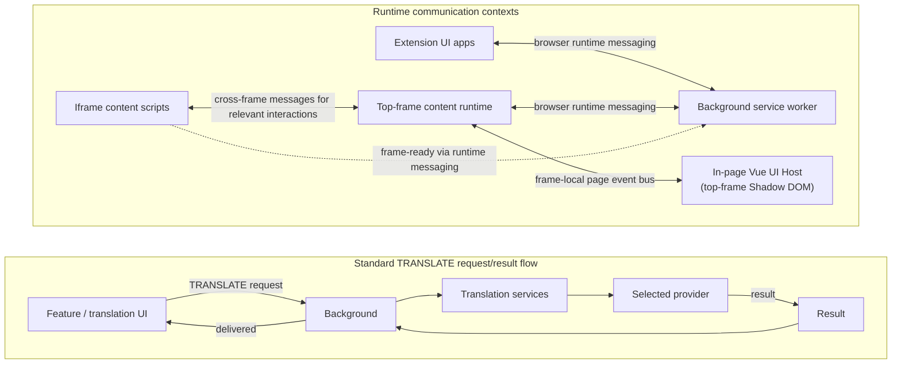

# Translate-It Extension Architecture

This document is a high-level map of the current repository and runtime. It is not a feature inventory or a behavioral contract. Use [CONTEXT.md](../../CONTEXT.md) for vocabulary and documentation authority; production code and tests establish current behavior, contracts state guarantees and ownership, and accepted ADRs record architectural decisions whose adoption may be partial or deferred.

## System overview

Feature-specific actions can use their own background handlers and orchestration before invoking shared translation services.

Field mode returns through the request's direct-response path; other routed modes use `UnifiedResultDispatcher` and/or their feature workflow, with streaming used where applicable. The request tracker owns accepted terminal transitions, while `StreamingManager` handles stream transport. For runtime routing and terminal-state diagrams, see [Translation System](architecture/TRANSLATION_SYSTEM.md) and [Architecture Diagrams](architecture/DIAGRAMS.md).

## Runtime contexts and ownership

### Background service worker

[`src/core/background/index.js`](../../src/core/background/index.js) registers providers, creates the `LifecycleManager`, and starts background initialization. `backgroundStartup.js` owns bounded retries around that initialization. `MessageHandler` dispatches incoming actions to registered handlers; `LifecycleManager` coordinates background initialization, handler registration, and starting the message listener. Its separate `feature-loader.js` loads browser-specific panel and context-menu managers; it is not the content-script feature loader.

For a translation request, `handleTranslate` invokes `UnifiedTranslationService`; the service uses `UnifiedModeCoordinator` and the `TranslationEngine` to run the selected mode. The translation engine/provider layer reports a valid result or a typed failure. Provider retry, same-provider API-key failover, and structured recovery are separate mechanisms; there is no automatic cross-provider fallback. See the [Provider Contract](contracts/PROVIDER_CONTRACT.md) for guarantees and ownership.

### Top-frame content script

[`src/core/content-scripts/index-main.js`](../../src/core/content-scripts/index-main.js) starts `ContentScriptCore`; it does not initialize `InteractionCoordinator` directly. After URL and runtime guards permit the allowed runtime, `ContentScriptCore` composes `MainFeatureLoader`, initializes the coordinator, and starts staged feature loading. `MainFeatureLoader` owns startup stages and their scheduling. `InteractionCoordinator` synchronizes eligible listeners and requests feature loads for matching interactions. `lazy-features.js` delegates activation and permission checks to `FeatureManager`.

Startup loading and interaction-triggered loading are distinct: startup stages can load some features without an interaction, and applicable whole-page auto-translate rules can request `contentMessageHandler` and `pageTranslation` during bootstrap. This is an architectural summary; see the [Smart Handler Registration guide](SMART_HANDLER_REGISTRATION_SYSTEM.md) for details.

### Iframe content script

[`src/core/content-scripts/index-iframe.js`](../../src/core/content-scripts/index-iframe.js) uses `IFrameContentScriptCore`, a lighter content runtime that excludes tiny/extension frames and does not mount the top-frame Vue UI. When allowed, it initializes the interaction coordinator, loads its limited content features, and signals frame readiness. Top-frame and iframe responsibilities are related but not interchangeable.

### Extension UI and in-page UI

`src/apps/` contains the popup, sidepanel, options, PDF, subtitle, and content Vue applications. Popup and sidepanel use shared translation composables and messaging; options provides configuration UI. `ContentApp` hosts in-page UI elements in the Shadow DOM. Page-side managers communicate with that UI through the page event bus rather than treating the host page as an extension UI surface. See the [UI Host guide](UI_HOST_SYSTEM.md) and [Messaging System guide](MessagingSystem.md).

UI state is managed in the relevant application/store. The settings Pinia store uses `StorageCore` for persistence, while background and content runtime code uses the `SettingsManager` facade and shared storage services. See [Storage Manager](STORAGE_MANAGER.md) for implementation detail.

## Cross-system boundaries

| Concern | Primary responsibility |
| --- | --- |
| Message handling and request lifecycle | `LifecycleManager`, `MessageHandler`, `UnifiedTranslationService`, and `TranslationRequestTracker` handle request entry, tracking, and terminal state. |
| Translation mode and execution | `UnifiedModeCoordinator` routes by mode; `TranslationEngine` and provider components execute translation work. |
| Result transport | `UnifiedResultDispatcher` routes supported results; streaming transport is handled separately by `StreamingManager`. Field mode uses a direct response path. |
| Feature application | Each feature workflow owns its application state and any page/document mutation; the shared provider pipeline does not own feature presentation. |
| Content feature activation | `FeatureManager` owns activation and permission policy; `MainFeatureLoader` schedules top-frame startup stages; `InteractionCoordinator` detects eligible interaction triggers. |
| Conversation acceptance | For Select Element logical parents, Background registers an immutable handoff before delivery; Content's FinalAcceptance is the semantic acceptance boundary, and Background's `ConversationAcceptanceCoordinator` coordinates acknowledgement and ordered history commit separately from provider execution. |
| State and persistence | UI stores own reactive view state; storage services provide persistence for the state that is persisted. |

These are architectural boundaries, not a promise that every mode uses every component. Per-feature guarantees belong in [Feature Contracts](contracts/FEATURE_CONTRACTS.md); conversation behavior belongs in the [Conversation Contract](contracts/CONVERSATION_CONTRACT.md).

## Repository map

| Area | Responsibility |
| --- | --- |
| `src/apps/` | Extension UI application entry points and app-specific composition. |
| `src/components/`, `src/composables/` | Reusable Vue components and composable integration. |
| `src/features/` | Feature workflows and domain-oriented modules, including translation providers, settings, selection, page translation, PDF, and subtitle translation. |
| `src/core/` | Background and content-script lifecycle, runtime services, and core managers. |
| `src/shared/` | Cross-feature infrastructure such as messaging, storage, logging, configuration, and error management. |
| `src/utils/` | Shared utility modules. |
| `docs/technical/` | Architecture, contracts, provider, infrastructure, and feature documentation; see the [technical documentation index](README.md). |

## Architectural decisions and adoption

Accepted ADRs describe decisions, not automatic proof of complete runtime adoption. In particular, [ADR-015](../adr/ADR-015-translation-outcome-semantics.md) records the target `TranslationOutcome` model, but universal runtime production and feature consumption remain deferred. [ADR-016](../adr/ADR-016-provider-completion-contract.md) allows incremental provider adoption. [ADR-017](../adr/ADR-017-conversation-acceptance-lifecycle-ownership.md) separates execution from conversation acceptance. Check implementation status and current code before treating an ADR model as deployed behavior.

## Further reading

- [Technical documentation index](README.md) — documentation categories and topic guides.
- [Translation System](architecture/TRANSLATION_SYSTEM.md) and [Architecture Diagrams](architecture/DIAGRAMS.md) — runtime routing and system flows.
- [Smart Handler Registration System](SMART_HANDLER_REGISTRATION_SYSTEM.md) — content-script startup, interaction triggers, and feature activation.
- [Contracts index](contracts/README.md) — guarantees and ownership by concern.
- [Provider Contract](contracts/PROVIDER_CONTRACT.md), [Feature Contracts](contracts/FEATURE_CONTRACTS.md), [Conversation Contract](contracts/CONVERSATION_CONTRACT.md), and [Identity & Fragment Contract](contracts/TRANSLATION_IDENTITY_AND_FRAGMENT_CONTRACT.md) — scoped behavioral guarantees.
- [Provider Implementation Guide](providers/PROVIDERS.md) — provider integration details.
